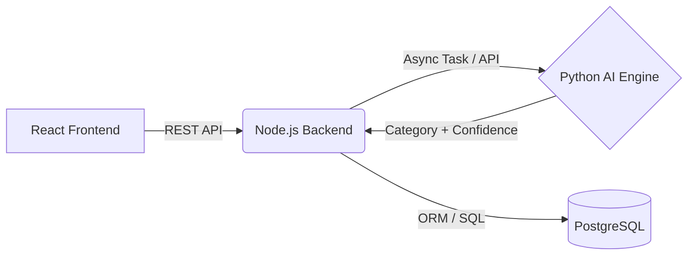

# Expense Tracker — Low-Friction, AI-Assisted Personal Finance (In Progress)

> In the AI era, manual data entry is the biggest reason users abandon expense tracking tools.
This project focuses on low-friction logging, combining fast manual input with AI-assisted categorization to help users understand where their money goes—without interrupting daily flow.

---

## 🧠 Why This Matters

Most expense trackers fail not because they lack features, but because logging an expense is slow, repetitive, and mentally taxing.
Even when bank notifications remind users that money was spent, they often skip recording it.

This project explores how AI-assisted understanding and engineering-driven defaults can reduce friction:

- Turn raw, messy transaction descriptions into structured data
- Minimize required user input
- Keep humans in control when automation is uncertain

The goal is simple:
from spending → recorded expense in under 5 seconds

---

## ✨ Key AI-Driven Capabilities

### Quick-Add Parsing
- Convert one-line input like 12.50 lunch into structured expense data

### AI-Assisted Categorization
- Python-based NLP model suggests categories from transaction text

### Human-in-the-Loop Design
- Ambiguous or low-confidence results are routed to an Inbox for user confirmation

### Learning Defaults
- The system remembers merchant-to-category mappings to improve future suggestions

> AI accelerates the workflow, but correctness and user trust are prioritized over blind automation.

---

## 🛠 Tech Stack (Hybrid Architecture)

### Frontend
- React
- TypeScript

### Backend
- Node.js
- Express
- Python (AI / NLP categorization engine)

### Database
- PostgreSQL

### Other
- JWT-based authentication
- RESTful APIs
- Prisma ORM

---

## 🧱 System Architecture

### Architecture Rationale
- Node.js handles authentication, APIs, and fast user interactions
- Python is used for AI/NLP workloads where the ecosystem is stronger
- The system is designed to be asynchronous, ensuring AI processing does not block user experience

---

## 🗄 Database & Data Modeling

- Normalized relational schema designed in PostgreSQL
- Indexed on:
  - user_id
  - occurred_at
  - merchant
- Enables efficient O(log n) monthly queries and category summaries
- Schema supports:
  - user-specific categories
  - human-in-the-loop Inbox
  - learned merchant rules for faster categorization

---

## 🤖 Machine Learning Approach

- Initial approach: rule-based + memory-driven categorization
- Planned AI enhancement:
  - Zero-shot or lightweight text classification
  - Models such as:
     - transformer-based zero-shot classifiers
     - or a custom scikit-learn pipeline
- Focus on:
  - interpretability
  - predictable behavior
  - graceful fallback when confidence is low
 
AI is used to assist, not override, user intent.

---

## 🧩 Technical Challenges & Solutions

### Challenge 1: Integrating Node.js and Python Without Blocking UX

Solution:
- Designed an asynchronous workflow where:
  - Node.js responds immediately to user input
  - Python AI processing runs in the background
  - Results are attached as suggestions rather than forced actions

### Challenge 2: Avoiding Incorrect Auto-Categorization

Solution:
- Introduced an Inbox model that requires user confirmation for ambiguous entries, balancing speed with correctness.

---

## 🎯 Design Principles

- Optimize for speed and minimal cognitive load
- Prefer sensible defaults over configuration
- Use AI where it meaningfully reduces friction
- Keep users in control of final data

---

## 🚀 Getting Started (Local Development)

> Setup instructions will be added as core features stabilize.

---

## 📸 Screenshots / Demo

> Screenshots or a short demo video will be added after MVP completion.

---

## 📈 Future Improvements

- CSV import with deduplication
- Improved AI categorization accuracy
- Spending trend visualization
- Mobile app version
- Voice-to-expense input (exploration)
- Secure bank data integration (e.g., Plaid)

---

## 🤖 AI-Assisted Development

AI tools may be used for boilerplate generation and exploratory suggestions.
All business logic, data modeling decisions, and debugging are reviewed, modified, and validated manually.
